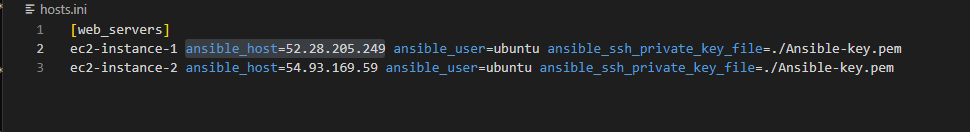
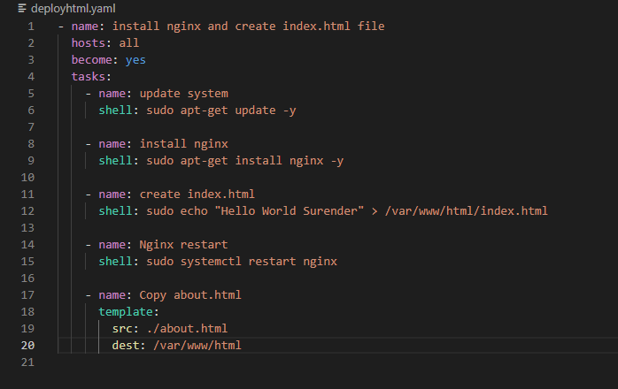
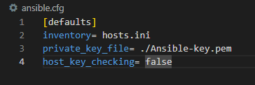
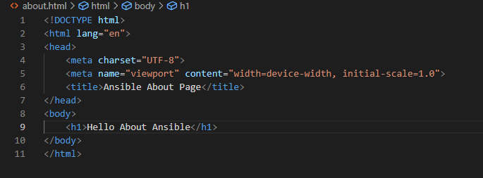

# Ansiable

## Install Ansible on ubuntu
- sudo apt-get update -y
- sudo apt=get install ansible -y
- ansible --version
- which ansible
- mkdir ansible-playbook-ec2
- cd ansible-playbook-ec2
- code .

## First playbook in ansible
- Create hosts.ini
- Create deployhtml.yaml
- Create ansible.cfg
- Create about.html

## Copy file in your directory
- chmod 400 Ansible-key.pem

## Execute Playbook
- ansible-playbook -i hosts.ini deployhtml.yaml
- ansible-playbook deployhtml.yaml --syntax-check
- ansible-playbook deployhtml.yaml --check
- ansible-playbook deployhtml.yaml